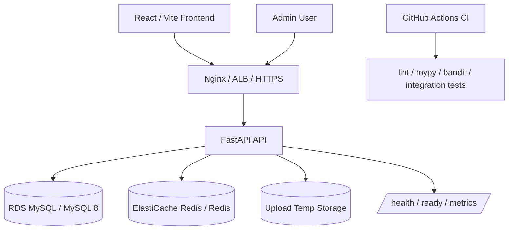
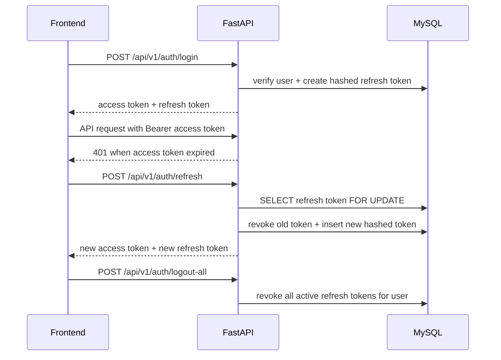
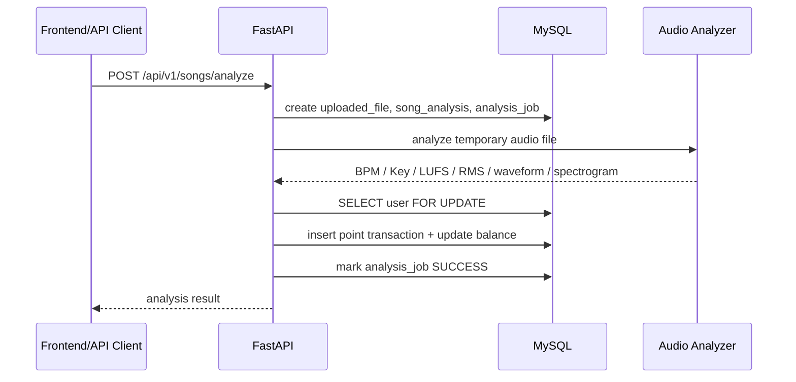

# Audio_Analysis_System

<p align="center">
  
</p>

`Audio_Analysis_System` 是面向音乐制作人、DJ、视频创作者和开发者的音频解析 SaaS。用户上传音频后，系统解析 BPM、Key、Duration、LUFS、RMS、波形和频谱图，并提供积分台账、解析历史、PDF 报告、API Key、管理员后台和审计日志。

## 功能覆盖

- 认证安全: JWT access token、refresh token rotation、refresh token hash、单设备 logout、logout-all。
- 数据层: MySQL 8、SQLAlchemy、Alembic migration、关键余额更新和订单支付使用 DB row lock。
- 缓存/限流: Redis 优先的限流中间件，Redis 不可用时自动降级到进程内限流。
- 权限: 普通用户、管理员权限、管理员操作审计日志。
- 可观测性: JSON structured logging、`X-Request-ID` tracing、`/health`、`/ready`、Prometheus 文本格式 `/metrics`。
- 商业化: 积分包、Mock Pay、订阅计划、优惠券、API Key 哈希保存、API usage log。
- 工程化: Docker Compose、迁移任务与 API 容器分离、CI、lint、mypy、security scan、integration tests、coverage gate。
- 前端: React + TypeScript + Vite 的真实 Web UI，支持登录、上传解析、历史、积分购买、API Key 和管理员后台。
- 运维: MySQL backup/restore 脚本、HTTPS reverse proxy 示例配置。

## 架构图



## 登录和 refresh token 流程



## 解析扣点流程



## Docker Compose

```bash
docker compose up --build
```

启动后:

- Web UI: `http://localhost:8080`
- API docs: `http://localhost:8000/docs`
- Health: `http://localhost:8000/health`
- Ready: `http://localhost:8000/ready`
- Metrics: `http://localhost:8000/metrics`

Compose 中包含 `mysql`、`redis`、`migrations`、`backend`、`frontend`。`migrations` 容器单独执行 `alembic upgrade head`，成功后 API 容器才启动。

## 本地开发

Backend:

```bash
cd backend
python -m venv .venv
source .venv/bin/activate
pip install -r requirements-dev.txt
cp ../.env.example .env
alembic -c alembic.ini upgrade head
uvicorn app.main:app --reload
```

Frontend:

```bash
cd frontend
npm install
npm run dev
```

不用 MySQL 做快速本地 API 验证时，可以临时使用 SQLite:

```bash
export AUDIO_DATABASE_URL=sqlite:///./local-dev.db
export AUDIO_AUTO_CREATE_TABLES=true
export AUDIO_REDIS_URL=
```

## 测试和质量检查

```bash
cd backend
ruff check .
mypy app scripts
bandit -r app scripts -x tests
pytest --cov=app --cov-report=term-missing --cov-fail-under=60

cd ../frontend
npm run lint
npm run build
```

## 备份和恢复

```bash
cd backend
MYSQL_HOST=127.0.0.1 MYSQL_USER=audio_user MYSQL_PASSWORD=audio_password ./scripts/backup_mysql.sh
MYSQL_HOST=127.0.0.1 MYSQL_USER=audio_user MYSQL_PASSWORD=audio_password ./scripts/restore_mysql.sh ./backups/audio_analysis_YYYYMMDD_HHMMSS.sql.gz
```

生产环境建议优先使用 RDS automated backup + point-in-time recovery；脚本用于低成本 EC2 或紧急手动导出。

## HTTPS / Reverse Proxy

示例配置在 `deploy/nginx/audio-analysis-system.conf`。需要替换:

- `server_name example.com www.example.com`
- Let’s Encrypt 证书路径
- 后端和前端 upstream 地址

本地 Compose 的 `frontend/nginx.conf` 已代理 `/api`、`/health`、`/ready` 和 `/metrics`。

## 最低成本 AWS 部署建议

最低成本、数据库前后端分离的推荐路径:

```text
Route53 / Domain
        ↓
ACM + ALB 或 EC2 Nginx + Let's Encrypt
        ↓
EC2 Docker Compose 或 ECS Fargate
        ↓
RDS MySQL db.t4g.micro / db.t4g.small
        ↓
ElastiCache Redis cache.t4g.micro
```

成本优先方案:

- 前端: S3 + CloudFront 最省；如果先求简单，可先放在同一台 EC2 的 Nginx。
- 后端: 单台 EC2 `t4g.small` 跑 Docker Compose，稳定后迁到 ECS Fargate。
- 数据库: RDS MySQL 单 AZ 起步，打开自动备份，生产后再做 Multi-AZ。
- Redis: ElastiCache 单节点 `cache.t4g.micro` 起步；预算极低时可先用同机 Redis，但生产隔离性较差。
- HTTPS: 有 ALB 时用 ACM；没有 ALB 时 EC2 Nginx + Let’s Encrypt 成本最低。
- 域名: Route53 托管域名，A/AAAA 指向 ALB，或 A 记录指向 EC2 Elastic IP。

生产最低安全基线:

- `AUDIO_JWT_SECRET_KEY` 使用随机长密钥，不能使用示例值。
- RDS/Redis 放私有子网，只允许后端安全组访问。
- 后端只通过 ALB/Nginx 暴露，关闭数据库公网访问。
- 开启 RDS automated backups，保留 7-14 天。
- CloudWatch 收集容器日志，至少对 `/ready`、5xx、CPU、RDS storage 设置告警。
